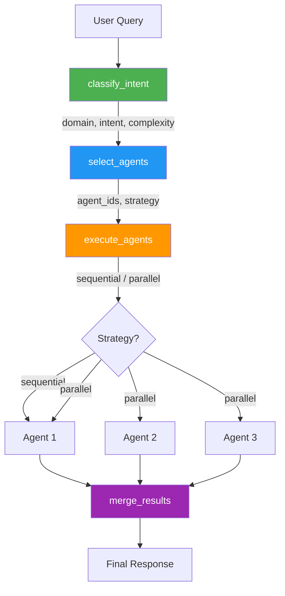
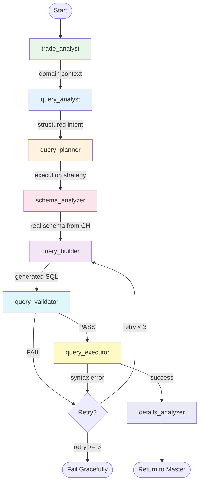
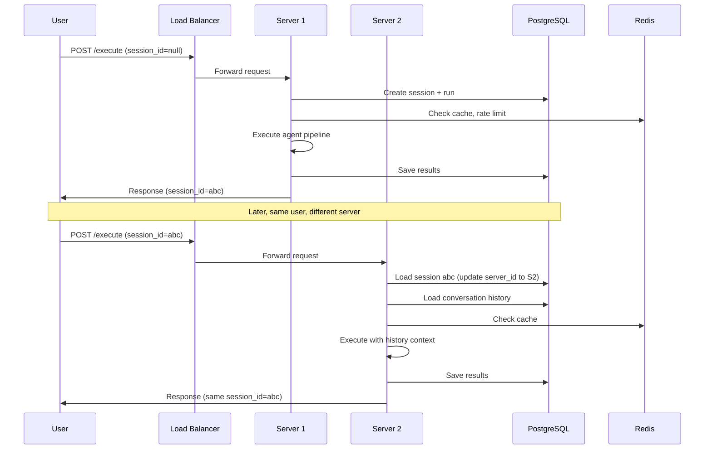
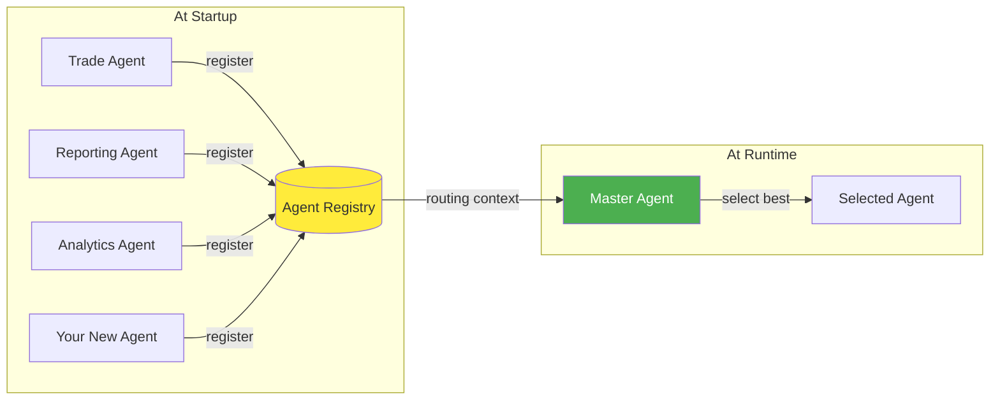
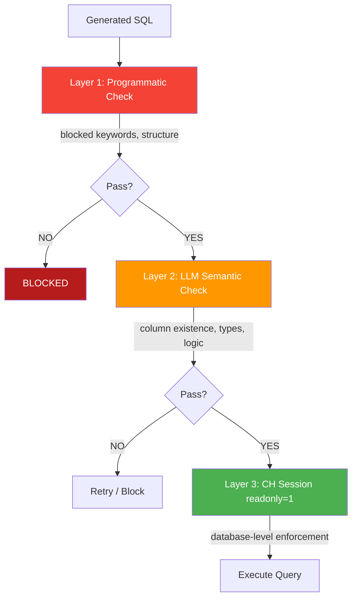

# Architecture Diagrams

## Master Agent Flow

```mermaid
flowchart TD
    A[User Query] --> B[classify_intent]
    B -->|domain, intent, complexity| C[select_agents]
    C -->|agent_ids, strategy| D[execute_agents]
    D -->|sequential / parallel| E{Strategy?}
    E -->|sequential| F1[Agent 1]
    E -->|parallel| F1 & F2[Agent 2] & F3[Agent 3]
    F1 --> G[merge_results]
    F2 --> G
    F3 --> G
    G --> H[Final Response]

    style B fill:#4CAF50,color:#fff
    style C fill:#2196F3,color:#fff
    style D fill:#FF9800,color:#fff
    style G fill:#9C27B0,color:#fff
```

## Trade Agent Sub-Graph

```mermaid
flowchart TD
    START([Start]) --> TA[trade_analyst]
    TA -->|domain context| QA[query_analyst]
    QA -->|structured intent| QP[query_planner]
    QP -->|execution strategy| SA[schema_analyzer]
    SA -->|real schema from CH| QB[query_builder]
    QB -->|generated SQL| QV[query_validator]

    QV -->|FAIL| RETRY{Retry?}
    RETRY -->|retry < 3| QB
    RETRY -->|retry >= 3| FAIL_END([Fail Gracefully])

    QV -->|PASS| QE[query_executor]
    QE -->|syntax error| RETRY
    QE -->|success| DA[details_analyzer]
    DA --> END_NODE([Return to Master])

    style TA fill:#E8F5E9
    style QA fill:#E3F2FD
    style QP fill:#FFF3E0
    style SA fill:#FCE4EC
    style QB fill:#F3E5F5
    style QV fill:#E0F7FA
    style QE fill:#FFF9C4
    style DA fill:#E8EAF6
```

## Multi-Server Session Flow

```mermaid
sequenceDiagram
    participant U as User
    participant LB as Load Balancer
    participant S1 as Server 1
    participant S2 as Server 2
    participant PG as PostgreSQL
    participant R as Redis

    U->>LB: POST /execute (session_id=null)
    LB->>S1: Forward request
    S1->>PG: Create session + run
    S1->>R: Check cache, rate limit
    S1->>S1: Execute agent pipeline
    S1->>PG: Save results
    S1->>U: Response (session_id=abc)

    Note over U,PG: Later, same user, different server
    U->>LB: POST /execute (session_id=abc)
    LB->>S2: Forward request
    S2->>PG: Load session abc (update server_id to S2)
    S2->>PG: Load conversation history
    S2->>R: Check cache
    S2->>S2: Execute with history context
    S2->>PG: Save results
    S2->>U: Response (same session_id=abc)
```

## Agent Registry & Discovery

```mermaid
flowchart LR
    subgraph Registration["At Startup"]
        T[Trade Agent] -->|register| REG[(Agent Registry)]
        R[Reporting Agent] -->|register| REG
        A[Analytics Agent] -->|register| REG
        N[Your New Agent] -->|register| REG
    end

    subgraph Routing["At Runtime"]
        REG -->|routing context| MA[Master Agent]
        MA -->|select best| CHOSEN[Selected Agent]
    end

    style REG fill:#FFEB3B
    style MA fill:#4CAF50,color:#fff
```

## Security Model: Defense in Depth

```mermaid
flowchart TD
    SQL[Generated SQL] --> L1[Layer 1: Programmatic Check]
    L1 -->|blocked keywords, structure| L1R{Pass?}
    L1R -->|NO| BLOCK1[BLOCKED]
    L1R -->|YES| L2[Layer 2: LLM Semantic Check]
    L2 -->|column existence, types, logic| L2R{Pass?}
    L2R -->|NO| RETRY[Retry / Block]
    L2R -->|YES| L3[Layer 3: CH Session readonly=1]
    L3 -->|database-level enforcement| EXEC[Execute Query]

    style L1 fill:#F44336,color:#fff
    style L2 fill:#FF9800,color:#fff
    style L3 fill:#4CAF50,color:#fff
    style BLOCK1 fill:#B71C1C,color:#fff
```
