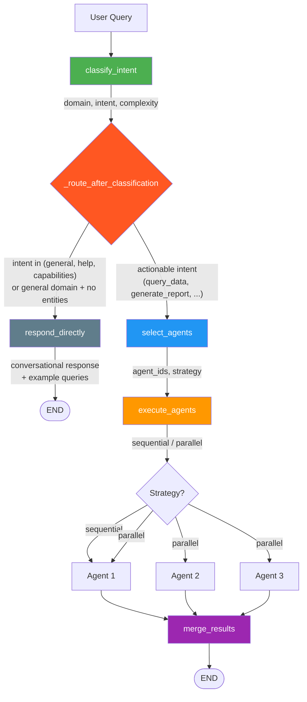
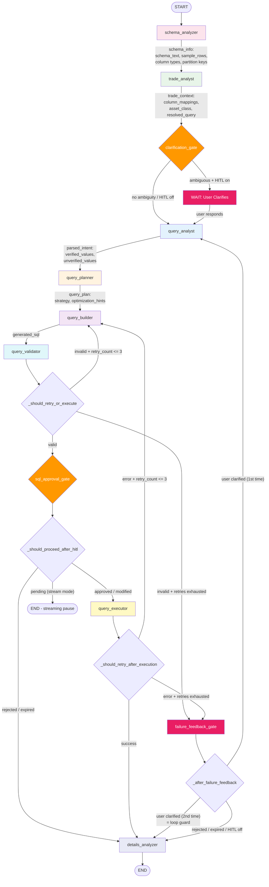
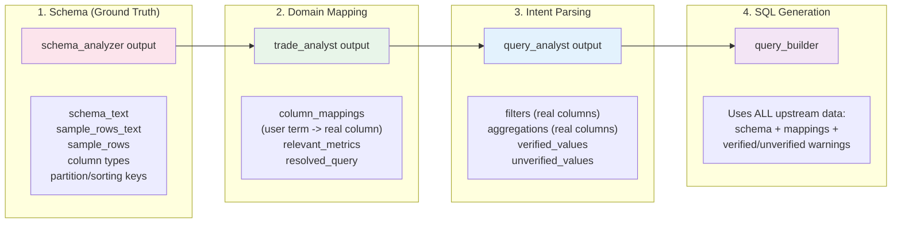
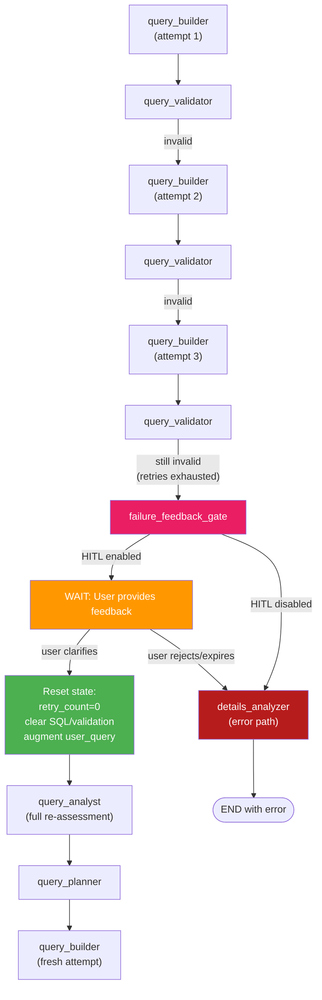
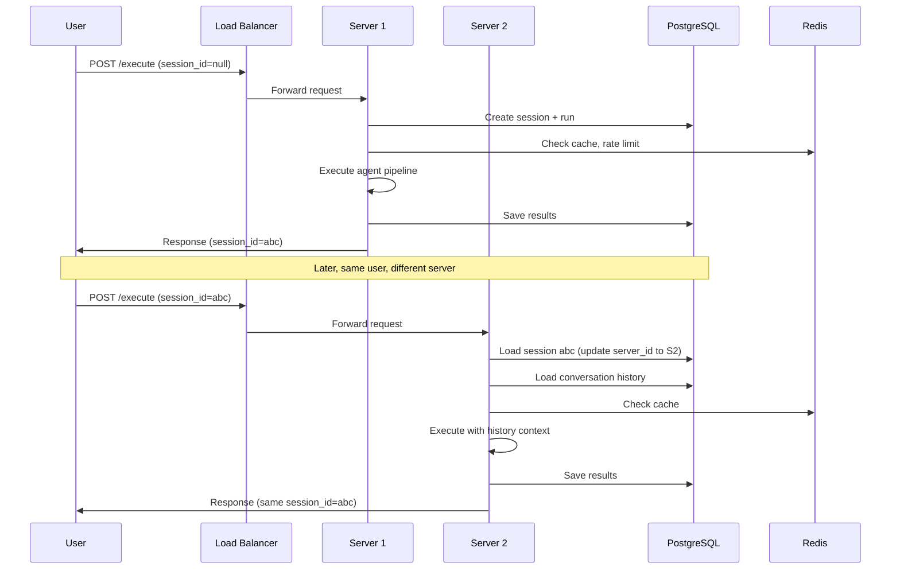
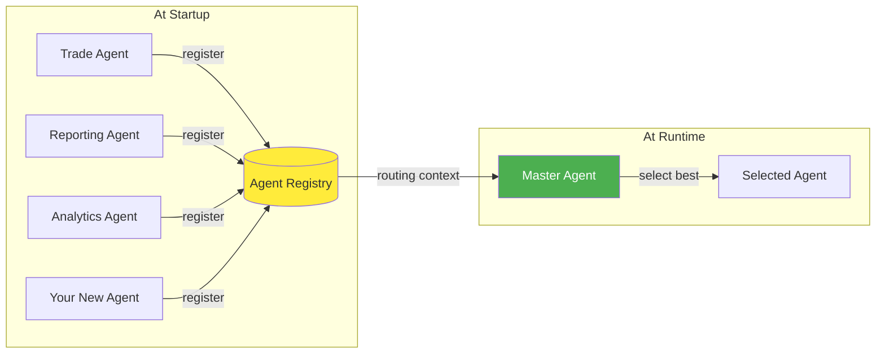
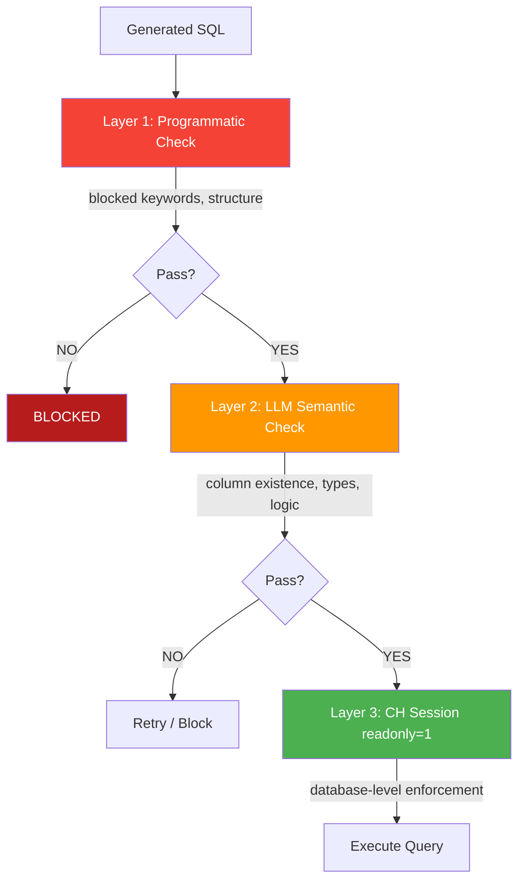
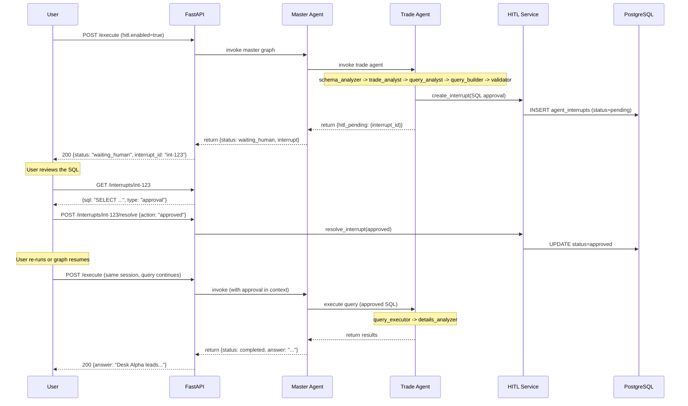

# Architecture Diagrams

## Master Agent Flow

### Routing Logic

| Condition | Route |
|-----------|-------|
| `intent` is `general`, `help`, or `capabilities` | `respond_directly` |
| `primary_domain == "general"` + no entities + non-actionable intent | `respond_directly` |
| Any actionable intent (`query_data`, `generate_report`, `plot_chart`, `send_email`, `summarize`, `explore_schema`, `anomaly_check`, `export_data`) | `select_agents` |

---

## Trade Agent Sub-Graph (Schema-First)

### Trade Agent Data Flow

### Node Dependency Matrix

| Node | Reads from state | Writes to state |
|------|-----------------|-----------------|
| `schema_analyzer` | (none - first node) | `schema_info` |
| `trade_analyst` | `schema_info`, `user_query`, `intent_analysis` | `trade_context` |
| `query_analyst` | `schema_info`, `trade_context`, `user_query` | `parsed_intent` |
| `query_planner` | `schema_info`, `parsed_intent`, `trade_context` | `query_plan` |
| `query_builder` | `schema_info`, `trade_context`, `parsed_intent`, `query_plan` | `generated_sql`, `sql_parameters` |
| `query_validator` | `generated_sql`, `schema_info` | `validation_result`, `needs_retry`, `retry_count` |
| `query_executor` | `generated_sql`, `sql_parameters` | `query_results`, `needs_retry` |
| `failure_feedback_gate` | `retry_feedback`, `generated_sql`, `user_query` | `user_query` (augmented), resets `retry_count` |
| `details_analyzer` | `query_results`, `user_query` | `analysis`, `artifacts` |

---

## Failure Recovery Flow

---

## Multi-Server Session Flow

---

## Agent Registry & Discovery

---

## Security Model: Defense in Depth

---

## Human-in-the-Loop: API Interaction Sequence

